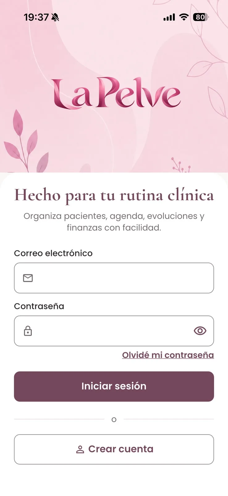
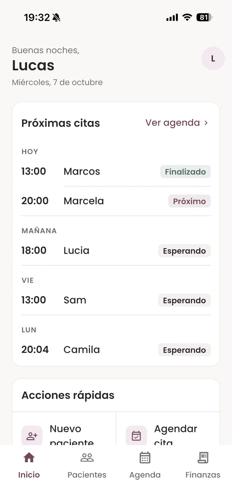
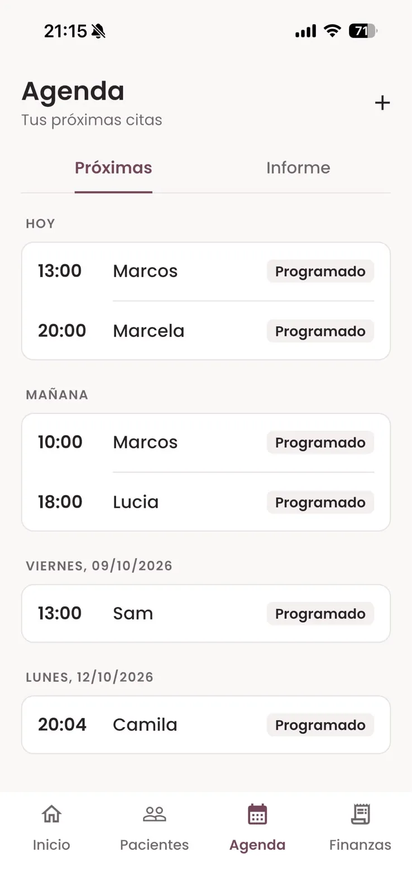
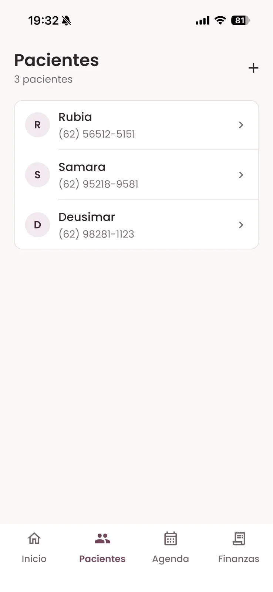
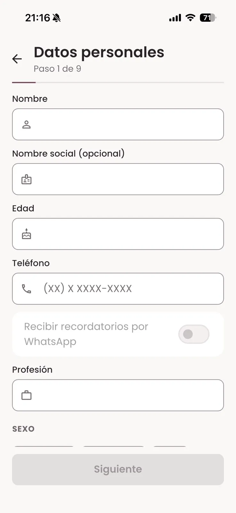
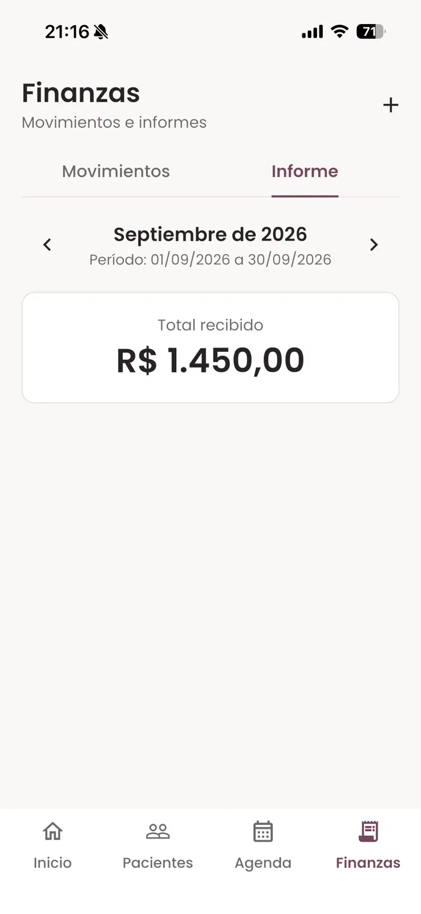

<p align="center">
  
</p>

<h1 align="center">La Pelve</h1>

<p align="center">
  Gestión clínica para fisioterapeutas de suelo pélvico: agenda, historia clínica, evoluciones y control financiero en una sola app.
</p>

<p align="center">
  
  
  
  
  
</p>

<p align="center">
  <a href="README.md">English</a> · <a href="README.pt-BR.md">Português</a> · <b>Español</b>
</p>

---

La Pelve es una herramienta para **fisioterapeutas** que trabajan con salud pélvica. Reemplaza hojas de cálculo y fichas en papel en una consulta individual o pequeña: agenda de citas, registro e historia clínica de las pacientes, evoluciones del tratamiento y registro de los cobros recibidos. La usa solo la profesional; las pacientes no usan la app.

## Disponibilidad

<a href="https://apps.apple.com/br/app/la-pelve/id6811234099"></a>

- **iOS**: publicada en la App Store.
- **Android** y **Web (PWA instalable)**: generadas a partir del mismo código.
- **Idiomas**: portugués (Brasil), inglés y español.
- **Temas**: claro y oscuro.

## Pantallas

<table>
<tr><td align="center" valign="top"><br><sub><b>Iniciar sesión</b></sub></td><td align="center" valign="top"><br><sub><b>Inicio</b></sub></td><td align="center" valign="top"><br><sub><b>Agenda</b></sub></td></tr>
<tr><td align="center" valign="top"><br><sub><b>Pacientes</b></sub></td><td align="center" valign="top"><br><sub><b>Registro por etapas</b></sub></td><td align="center" valign="top"><br><sub><b>Informe financiero</b></sub></td></tr>
</table>

## Funcionalidades

**Agenda**
- Próximas citas agrupadas por día, con creación, edición y eliminación rápidas.
- Citas vinculadas al registro de la paciente o ingresadas solo con el nombre.
- Cambio de estado con un toque: agendada, confirmada, realizada, cancelada, ausencia y reprogramada.
- Informe mensual de la agenda con el total de citas.

**Pacientes e historia clínica**
- Registro guiado de hasta 11 pasos, basado en una evaluación de fisioterapia pélvica: datos personales, anamnesis, antecedentes ginecológicos y obstétricos (cuando corresponde), antecedentes quirúrgicos, función urinaria, sexual e intestinal, plan de tratamiento, archivos de la evaluación y valor de la consulta.
- Historia clínica de solo lectura, organizada por secciones.
- Evoluciones del tratamiento con fecha e historial de edición.
- Adjuntos por paciente (fotos y PDF), con vista previa en la app.
- Cierre del tratamiento con motivo y resultado (alta, abandono, derivación, otro), que se puede reabrir.

**Finanzas**
- Registro de los cobros recibidos, vinculados a una paciente o sueltos, con forma de pago y estado.
- Informe financiero mensual con el total recibido y el detalle de cada registro.
- Es solo control: la app no procesa pagos ni se conecta a bancos.

**Inicio**
- Próximas citas y un resumen de la consulta: pacientes activas, citas de la semana y monto recibido en el mes.

**Perfil y cuenta**
- Inicio de sesión con correo y contraseña, registro con confirmación de correo y recuperación de contraseña.
- Perfil profesional con foto y número de registro profesional (Crefito).
- Cambio de contraseña, idioma y tema.
- Bloqueo de la app con biometría en el móvil.
- Eliminación de la cuenta por la propia profesional, que borra los datos y archivos de la cuenta.

**En desarrollo: recordatorios de citas por WhatsApp**
- La base para recordatorios opcionales de citas mediante la cuenta de WhatsApp Business de cada profesional ya existe: registro del consentimiento por paciente y pantalla de conexión en el perfil. El envío de recordatorios todavía no está activo. Los recordatorios están pensados para incluir solo los datos de la cita, nunca información clínica.

## Privacidad y tratamiento de datos

La Pelve maneja información sensible de salud, por lo que el acceso a los datos está restringido desde el diseño.

- **Acceso solo para la profesional.** Solo la profesional autenticada usa la app. No hay inicio de sesión ni interfaz para pacientes.
- **Autenticación** mediante Supabase Auth (correo y contraseña), con bloqueo biométrico opcional en el móvil.
- **Control de acceso por fila.** Cada tabla con datos de pacientes o clínicos (pacientes, evoluciones, citas, adjuntos y registros financieros) está protegida con Row Level Security en PostgreSQL: cada profesional solo puede leer y escribir sus propios registros.
- **Archivos en almacenamiento privado.** Los adjuntos y fotos de perfil están en buckets privados y se entregan mediante URLs firmadas de corta duración.
- **Datos mínimos en los recordatorios.** Los recordatorios de WhatsApp previstos se limitan a los datos de la cita, se envían solo a pacientes que dieron su consentimiento y el historial de consentimiento queda registrado.
- **La eliminación de la cuenta** borra los datos y archivos de la profesional.
- La app es una herramienta de registro y organización. No diagnostica, no prescribe tratamientos y no reemplaza el criterio clínico de la profesional.

No aparece ningún dato real de pacientes en este repositorio ni en las pantallas.

## Arquitectura

- **App Flutter** con Clean Architecture organizada por feature (domain, data, presentation), Cubits para el estado, `get_it` para la inyección de dependencias y `go_router` para la navegación.
- **Supabase** para autenticación, PostgreSQL con Row Level Security, Storage privado y Edge Functions.
- **Migraciones versionadas** en `supabase/migrations`, con despliegues en producción acompañados de verificaciones previas, scripts de reversión y verificaciones posteriores.
- **Versión web** servida como archivos estáticos en Cloudflare Workers, con enrutamiento de single-page application.

## Tecnologías

| Capa | Tecnología |
| --- | --- |
| App | Flutter, Dart |
| Estado | `flutter_bloc` (Cubit) |
| DI / Navegación | `get_it`, `go_router` |
| Backend | Supabase: Auth, PostgreSQL, RLS, Storage, Edge Functions (Deno) |
| Hosting web | Cloudflare Workers (archivos estáticos) |
| Tests | `flutter_test` |

## Estructura del proyecto

```
lib/
├── core/           DI, rutas, tema, l10n, config
├── shared/         widgets reutilizables
└── features/
    ├── auth/
    ├── home/
    ├── agenda/        agenda e informes de citas
    ├── patients/      registro, historia clínica, evoluciones, adjuntos
    ├── financial/     registros e informes financieros
    └── profile/       perfil, ajustes, biometría, eliminación de cuenta

supabase/
├── migrations/     esquema, policies de RLS y buckets de storage
├── functions/      Edge Functions
└── rollout-*/      scripts de verificación previa, reversión y verificación posterior
```

## Ejecución local

Requisitos: Flutter (canal stable) y un proyecto de Supabase.

1. Copia `env.example.json` a `env.json` y completa la URL del proyecto de Supabase y la publishable key.
2. Aplica las migraciones de `supabase/migrations` en el proyecto.
3. Ejecuta la app:

```bash
flutter pub get
flutter run --dart-define-from-file=env.json
```

```bash
flutter analyze
flutter test
```

## Estado del proyecto

Publicada en la App Store y en desarrollo activo.

## Licencia

No se concede ninguna licencia de código abierto. El código está visible como parte de un portafolio; todos los derechos reservados.

## Acerca de

Desarrollado por Lucas Diogo França. Caso de estudio: [lucksrei.com/projects/la-pelve](https://lucksrei.com/projects/la-pelve/)
