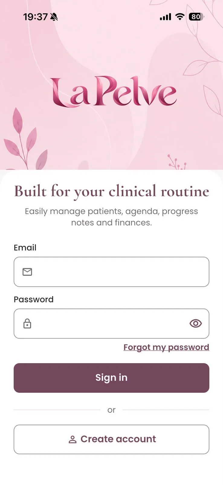
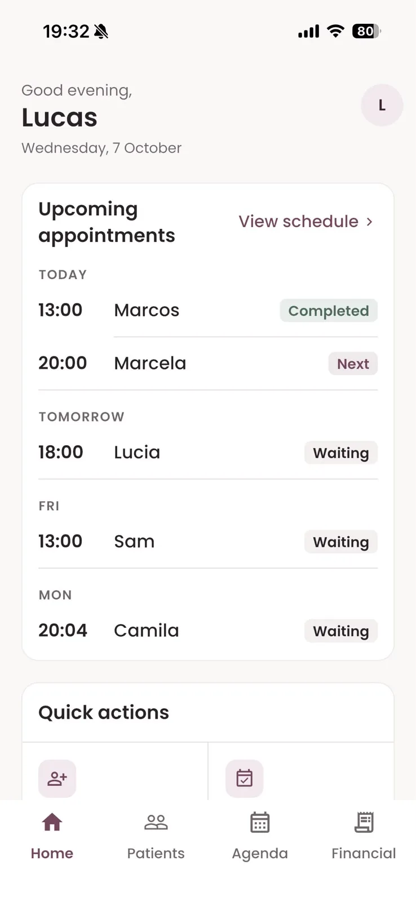
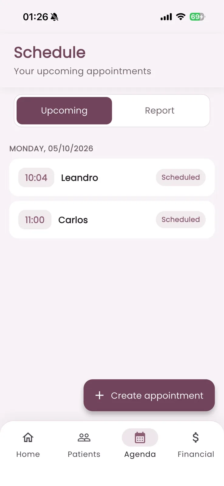
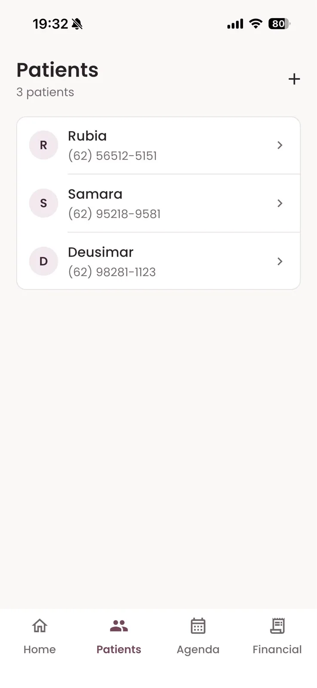
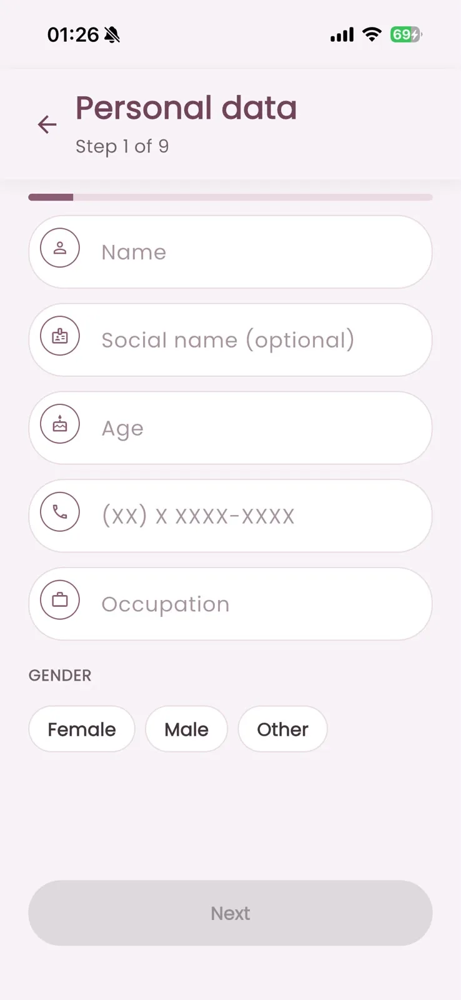
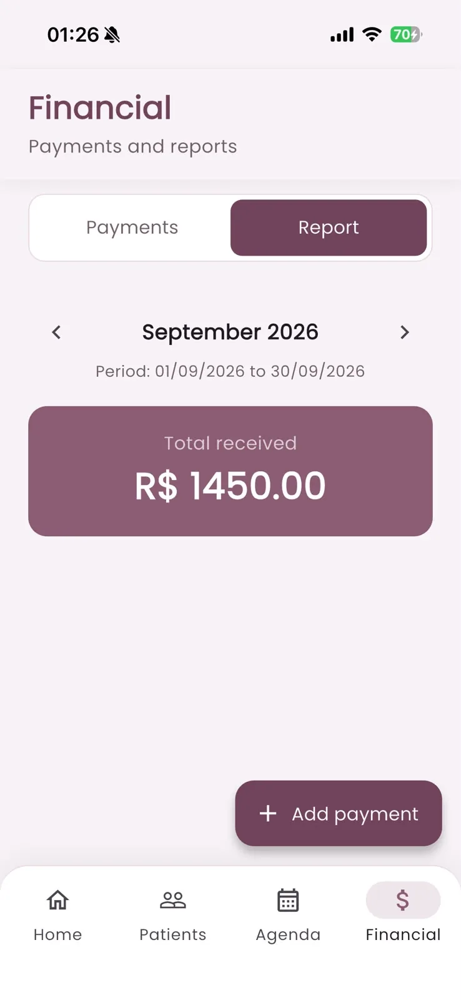

<p align="center">
  
</p>

<h1 align="center">La Pelve</h1>

<p align="center">
  Clinical management for pelvic physiotherapists: schedule, patient records, progress notes and payment tracking in one app.
</p>

<p align="center">
  
  
  
  
  
</p>

<p align="center">
  <b>English</b> · <a href="README.pt-BR.md">Português</a> · <a href="README.es.md">Español</a>
</p>

---

La Pelve is a tool for **physiotherapists** who work with pelvic health. It replaces spreadsheets and paper charts for a solo or small practice: appointment scheduling, patient intake and clinical history, treatment progress notes and a record of payments received. It is used by the professional only; patients do not use the app.

## Availability

<a href="https://apps.apple.com/br/app/la-pelve/id6811234099"></a>

- **iOS**: published on the App Store.
- **Android** and **Web (installable PWA)**: built from the same codebase.
- **Languages**: Portuguese (Brazil), English and Spanish.
- **Themes**: light and dark.

## Screenshots

<table>
<tr><td align="center" valign="top"><br><sub><b>Sign in</b></sub></td><td align="center" valign="top"><br><sub><b>Home</b></sub></td><td align="center" valign="top"><br><sub><b>Schedule</b></sub></td></tr>
<tr><td align="center" valign="top"><br><sub><b>Patients</b></sub></td><td align="center" valign="top"><br><sub><b>Step-by-step registration</b></sub></td><td align="center" valign="top"><br><sub><b>Financial report</b></sub></td></tr>
</table>

## Features

**Schedule**
- Upcoming appointments grouped by day, with quick creation, editing and deletion.
- Appointments linked to a patient record or entered by name.
- One-tap status changes: scheduled, confirmed, attended, cancelled, no-show and rescheduled.
- Monthly schedule report with the total number of appointments.

**Patients and clinical record**
- Guided intake in up to 11 steps, modeled after a pelvic physiotherapy assessment: personal data, anamnesis, gynecological and obstetric history (shown when applicable), surgical history, urinary, sexual and bowel function, treatment plan, assessment files and consultation fee.
- Read-only clinical record organized by section.
- Progress notes (evolution log) with dates and edit history.
- Attachments per patient (photos and PDFs), with in-app preview.
- Treatment closure with reason and outcome (discharged, discontinued, referred, other), which can be reopened.

**Finances**
- Records of payments received, linked to a patient or entered on their own, with payment method and status.
- Monthly financial report with the total received and a per-entry breakdown.
- This is record keeping only: the app does not process payments or connect to banks.

**Home**
- Upcoming appointments and a clinic overview: active patients, appointments this week and amount received this month.

**Profile and account**
- Email and password sign-in, sign-up with email confirmation and password reset.
- Professional profile with photo and Crefito (professional license) number.
- Password change, language and theme settings.
- Biometric app lock on mobile.
- Self-service account deletion, removing the account data and stored files.

**In development: WhatsApp appointment reminders**
- The groundwork for optional appointment reminders through each professional's own WhatsApp Business account is in place: per-patient consent capture and a connection screen in the profile. Sending reminders is not active yet. Reminders are designed to carry only appointment details, never clinical information.

## Privacy and data handling

La Pelve handles sensitive health information, so data access is restricted by design.

- **Professional-only access.** Only the authenticated professional uses the app. There is no patient login and no patient-facing interface.
- **Authentication** is handled by Supabase Auth (email and password), with an optional biometric lock on mobile devices.
- **Row-level access control.** Every table with patient or clinical data (patients, progress notes, appointments, attachments and financial entries) is protected by PostgreSQL Row Level Security, so each professional can only read and write their own records.
- **Private file storage.** Attachments and profile photos live in private storage buckets and are delivered through short-lived signed URLs.
- **Minimal data in reminders.** The planned WhatsApp reminders are limited to appointment details, sent only to patients who have given consent, with consent history kept on record.
- **Account deletion** removes the professional's data and files.
- The app is a record-keeping tool. It does not provide diagnoses, does not prescribe treatment and does not replace the professional's clinical judgment.

No real patient data appears in this repository or in the screenshots.

## Architecture

- **Flutter app** with feature-first Clean Architecture (domain, data, presentation), Cubits for state, `get_it` for dependency injection and `go_router` for navigation.
- **Supabase** for authentication, PostgreSQL with Row Level Security, private Storage and Edge Functions.
- **Versioned migrations** in `supabase/migrations`, with production rollouts accompanied by pre-flight checks, rollback scripts and post-checks.
- **Web build** served as static assets on Cloudflare Workers, with single-page-application routing.

## Tech stack

| Layer | Technology |
| --- | --- |
| App | Flutter, Dart |
| State | `flutter_bloc` (Cubit) |
| DI / Routing | `get_it`, `go_router` |
| Backend | Supabase: Auth, PostgreSQL, RLS, Storage, Edge Functions (Deno) |
| Web hosting | Cloudflare Workers (static assets) |
| Tests | `flutter_test` |

## Project structure

```
lib/
├── core/           DI, routing, theme, l10n, config
├── shared/         reusable widgets
└── features/
    ├── auth/
    ├── home/
    ├── agenda/        schedule and appointment reports
    ├── patients/      intake, clinical record, progress notes, attachments
    ├── financial/     payment records and reports
    └── profile/       profile, settings, biometric lock, account deletion

supabase/
├── migrations/     schema, RLS policies and storage buckets
├── functions/      Edge Functions
└── rollout-*/      pre-flight, rollback and post-check scripts
```

## Running locally

Requirements: Flutter (stable channel) and a Supabase project.

1. Copy `env.example.json` to `env.json` and fill in the Supabase project URL and publishable key.
2. Apply the migrations in `supabase/migrations` to the project.
3. Run the app:

```bash
flutter pub get
flutter run --dart-define-from-file=env.json
```

```bash
flutter analyze
flutter test
```

## Project status

Published on the App Store and in active development.

## License

No open-source license is granted. The source code is visible as part of a portfolio; all rights are reserved.

## About

Built by Lucas Diogo França. Case study: [lucksrei.com/projects/la-pelve](https://lucksrei.com/projects/la-pelve/)
