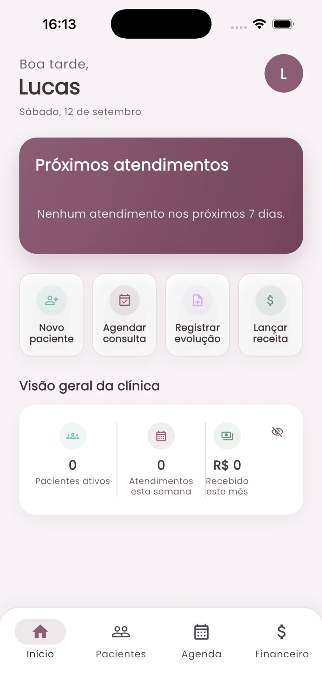
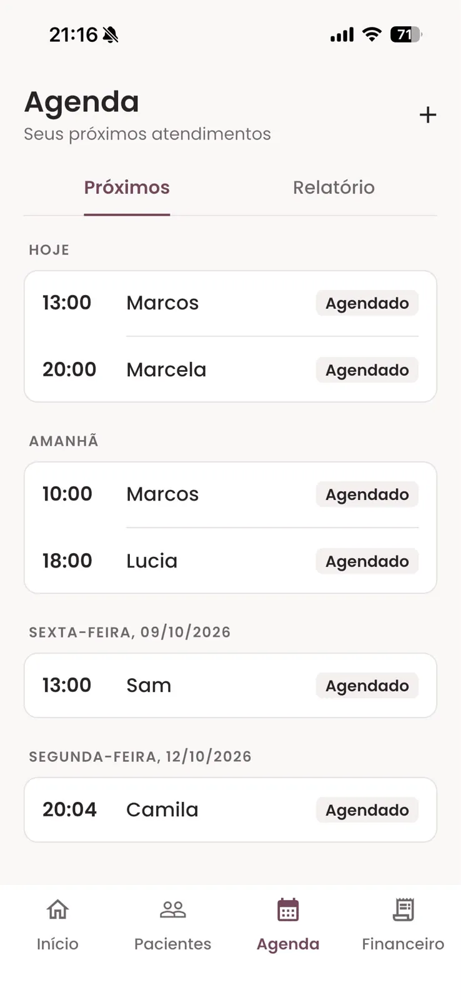
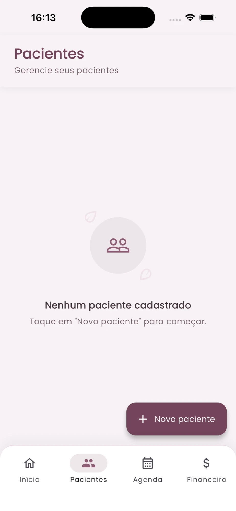
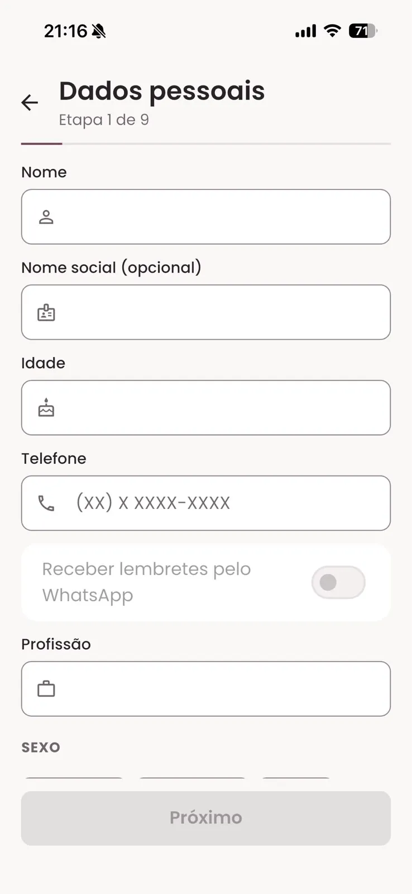
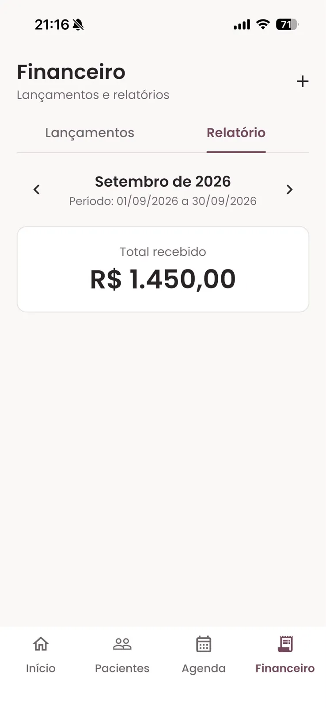

<p align="center">
  
</p>

<h1 align="center">La Pelve</h1>

<p align="center">
  Gestão clínica para fisioterapeutas pélvicas: agenda, prontuário, evoluções e controle financeiro num só app.
</p>

<p align="center">
  
  
  
  
  
</p>

<p align="center">
  <a href="README.md">English</a> · <b>Português</b> · <a href="README.es.md">Español</a>
</p>

---

O La Pelve é uma ferramenta para **fisioterapeutas** que atuam com saúde pélvica. Ele substitui planilhas e fichas em papel num consultório individual ou pequeno: agendamento, cadastro e histórico clínico das pacientes, evoluções do tratamento e registro dos valores recebidos. Quem usa o app é a profissional; as pacientes não usam o app.

## Disponibilidade

<a href="https://apps.apple.com/br/app/la-pelve/id6811234099"></a>

- **iOS**: publicado na App Store.
- **Android** e **Web (PWA instalável)**: gerados a partir da mesma base de código.
- **Idiomas**: português (Brasil), inglês e espanhol.
- **Temas**: claro e escuro.

## Telas

<table>
<tr><td align="center" valign="top"><br><sub><b>Entrar</b></sub></td><td align="center" valign="top"><br><sub><b>Início</b></sub></td><td align="center" valign="top"><br><sub><b>Agenda</b></sub></td></tr>
<tr><td align="center" valign="top"><br><sub><b>Pacientes</b></sub></td><td align="center" valign="top"><br><sub><b>Cadastro em etapas</b></sub></td><td align="center" valign="top"><br><sub><b>Relatório financeiro</b></sub></td></tr>
</table>

## Funcionalidades

**Agenda**
- Próximos atendimentos agrupados por dia, com criação, edição e exclusão rápidas.
- Atendimentos ligados ao cadastro da paciente ou lançados só pelo nome.
- Mudança de status com um toque: agendado, confirmado, realizado, cancelado, falta e remarcado.
- Relatório mensal da agenda com o total de atendimentos.

**Pacientes e prontuário**
- Cadastro guiado em até 11 etapas, baseado numa avaliação de fisioterapia pélvica: dados pessoais, anamnese, histórico ginecológico e obstétrico (quando se aplica), histórico cirúrgico, função urinária, sexual e intestinal, plano de tratamento, arquivos da avaliação e valor da consulta.
- Prontuário para leitura, organizado por seção.
- Evoluções do tratamento com data e histórico de edição.
- Anexos por paciente (fotos e PDFs), com visualização no próprio app.
- Encerramento do tratamento com motivo e desfecho (alta, abandono, encaminhamento, outro), que pode ser reaberto.

**Financeiro**
- Registro dos valores recebidos, ligados a uma paciente ou avulsos, com forma de pagamento e status.
- Relatório financeiro mensal com o total recebido e o detalhe de cada lançamento.
- É apenas controle: o app não processa pagamentos nem se conecta a bancos.

**Início**
- Próximos atendimentos e uma visão geral da clínica: pacientes ativas, atendimentos da semana e valor recebido no mês.

**Perfil e conta**
- Login com e-mail e senha, cadastro com confirmação de e-mail e recuperação de senha.
- Perfil profissional com foto e número do Crefito.
- Troca de senha, idioma e tema.
- Bloqueio do app por biometria no celular.
- Exclusão de conta pela própria profissional, removendo os dados e os arquivos da conta.

**Em desenvolvimento: lembretes de consulta pelo WhatsApp**
- A base para lembretes opcionais de consulta pelo WhatsApp Business de cada profissional já existe: registro de consentimento por paciente e tela de conexão no perfil. O envio dos lembretes ainda não está ativo. Os lembretes foram pensados para levar só os dados do atendimento, nunca informação clínica.

## Privacidade e tratamento de dados

O La Pelve lida com informação sensível de saúde, então o acesso aos dados é restrito desde o desenho.

- **Acesso só da profissional.** Apenas a profissional autenticada usa o app. Não existe login nem interface para pacientes.
- **Autenticação** pelo Supabase Auth (e-mail e senha), com bloqueio opcional por biometria no celular.
- **Controle de acesso por linha.** Toda tabela com dado de paciente ou clínico (pacientes, evoluções, atendimentos, anexos e lançamentos financeiros) é protegida por Row Level Security no PostgreSQL: cada profissional só lê e grava os próprios registros.
- **Arquivos em storage privado.** Anexos e fotos de perfil ficam em buckets privados e são entregues por URLs assinadas de curta duração.
- **Mínimo de dados nos lembretes.** Os lembretes de WhatsApp planejados se limitam aos dados do atendimento, vão só para pacientes que deram consentimento, e o histórico de consentimento fica registrado.
- **Exclusão de conta** remove os dados e os arquivos da profissional.
- O app é uma ferramenta de registro e organização. Não faz diagnóstico, não prescreve tratamento e não substitui o julgamento clínico da profissional.

Nenhum dado real de paciente aparece neste repositório ou nas telas.

## Arquitetura

- **App Flutter** com Clean Architecture organizada por feature (domain, data, presentation), Cubits para estado, `get_it` para injeção de dependência e `go_router` para navegação.
- **Supabase** para autenticação, PostgreSQL com Row Level Security, Storage privado e Edge Functions.
- **Migrations versionadas** em `supabase/migrations`, com rollouts em produção acompanhados de verificação prévia, script de rollback e pós-checagem.
- **Versão web** servida como arquivos estáticos no Cloudflare Workers, com roteamento de single-page application.

## Tecnologias

| Camada | Tecnologia |
| --- | --- |
| App | Flutter, Dart |
| Estado | `flutter_bloc` (Cubit) |
| DI / Navegação | `get_it`, `go_router` |
| Backend | Supabase: Auth, PostgreSQL, RLS, Storage, Edge Functions (Deno) |
| Hospedagem web | Cloudflare Workers (arquivos estáticos) |
| Testes | `flutter_test` |

## Estrutura do projeto

```
lib/
├── core/           DI, rotas, tema, l10n, config
├── shared/         widgets reutilizáveis
└── features/
    ├── auth/
    ├── home/
    ├── agenda/        agenda e relatórios de atendimentos
    ├── patients/      cadastro, prontuário, evoluções, anexos
    ├── financial/     lançamentos e relatórios financeiros
    └── profile/       perfil, configurações, biometria, exclusão de conta

supabase/
├── migrations/     schema, policies de RLS e buckets de storage
├── functions/      Edge Functions
└── rollout-*/      scripts de verificação prévia, rollback e pós-checagem
```

## Rodando localmente

Requisitos: Flutter (canal stable) e um projeto Supabase.

1. Copie `env.example.json` para `env.json` e preencha a URL do projeto Supabase e a publishable key.
2. Aplique as migrations de `supabase/migrations` no projeto.
3. Rode o app:

```bash
flutter pub get
flutter run --dart-define-from-file=env.json
```

```bash
flutter analyze
flutter test
```

## Status do projeto

Publicado na App Store e em desenvolvimento ativo.

## Licença

Nenhuma licença open source é concedida. O código está visível como parte de um portfólio; todos os direitos reservados.

## Sobre

Desenvolvido por Lucas Diogo França. Case: [lucksrei.com/projects/la-pelve](https://lucksrei.com/projects/la-pelve/)
